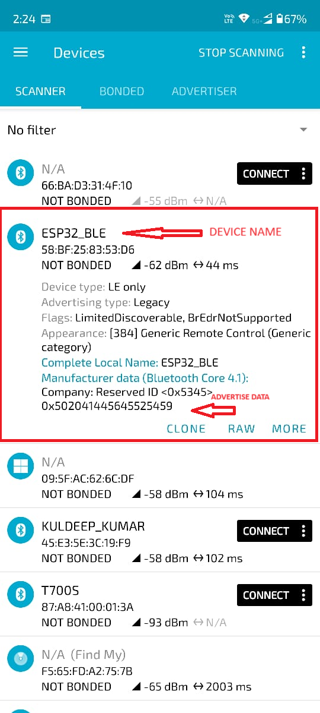

| Supported Targets | ESP32 | ESP32-C3 | ESP32-S3 |
| ----------------- | ----- | -------- | -------- |

# ESP32 BLE ADVERTISEMENT

ESP Based BLE Advertiser is a simple Bluetooth Low Energy (BLE) broadcast application developed using `ESP32` microcontroller. It Broadcast data that can be scan from the near by devices without making connection.

## Features

- It can advertisement data as per the user requirement. If we want to Broadcast the data periodically then we need to call ```Bluetooth_data_advertisement()``` function periodically. 

## Usage

1. **Hardware Setup:**
   - Connect the ESP32S3 microcontroller to the necessary peripherals and power source.

2. **Code Compilation and Flashing:**
   - Compile the provided code using the appropriate toolchain and flash it onto the ESP32 microcontroller.
   - Ensure that the required libraries and dependencies are properly installed and configured.

3. **Running the Application:**
   - Once the code is flashed onto the ESP32, the BLE Broadcast the DATA.


## Dependencies

- FreeRTOS
- ESP-IDF (Espressif IoT Development Framework)
- ESP32 BLE Stack


## How to Use Example

Before project configuration and build, be sure to set the correct chip target using:

```bash
idf.py set-target <chip_name>
```

### Hardware Required

* A development board with ESP32/ESP32-C3/ESP32-S3 SoC (e.g., ESP32-DevKitC, ESP-WROVER-KIT, etc.)
* A USB cable for Power supply and programming

### Build and Flash

Run `idf.py -p PORT flash monitor` to build, flash and monitor the project.

(To exit the serial monitor, type ``Ctrl-]``.)


## Example Output

```
I (31) boot: ESP-IDF v5.2.1 2nd stage bootloader
I (31) boot: compile time Mar 21 2024 02:07:09
I (31) boot: Multicore bootloader
I (35) boot: chip revision: v1.0
I (39) boot.esp32: SPI Speed      : 40MHz
I (43) boot.esp32: SPI Mode       : DIO
I (48) boot.esp32: SPI Flash Size : 2MB
I (52) boot: Enabling RNG early entropy source...
I (58) boot: Partition Table:
I (61) boot: ## Label            Usage          Type ST Offset   Length
I (69) boot:  0 nvs              WiFi data        01 02 00009000 00006000
I (76) boot:  1 phy_init         RF data          01 01 0000f000 00001000
I (84) boot:  2 factory          factory app      00 00 00010000 00100000
I (91) boot: End of partition table
I (95) esp_image: segment 0: paddr=00010020 vaddr=3f400020 size=22954h (141652) map
I (152) esp_image: segment 1: paddr=0003297c vaddr=3ffbdb60 size=04994h ( 18836) load
I (160) esp_image: segment 2: paddr=00037318 vaddr=40080000 size=08d00h ( 36096) load
I (174) esp_image: segment 3: paddr=00040020 vaddr=400d0020 size=7fb3ch (523068) map
I (353) esp_image: segment 4: paddr=000bfb64 vaddr=40088d00 size=1029ch ( 66204) load
I (392) boot: Loaded app from partition at offset 0x10000
I (392) boot: Disabling RNG early entropy source...
I (404) cpu_start: Multicore app
I (413) cpu_start: Pro cpu start user code
I (413) cpu_start: cpu freq: 160000000 Hz
I (413) cpu_start: Application information:
I (416) cpu_start: Project name:     BLE_BROADCAST
I (421) cpu_start: App version:      d3476e6
I (426) cpu_start: Compile time:     Mar 21 2024 02:06:11
I (432) cpu_start: ELF file SHA256:  6dc6be99a...
I (438) cpu_start: ESP-IDF:          v5.2.1
I (442) cpu_start: Min chip rev:     v0.0
I (447) cpu_start: Max chip rev:     v3.99
I (452) cpu_start: Chip rev:         v1.0
I (457) heap_init: Initializing. RAM available for dynamic allocation:
I (464) heap_init: At 3FFAFF10 len 000000F0 (0 KiB): DRAM
I (470) heap_init: At 3FFB6388 len 00001C78 (7 KiB): DRAM
I (476) heap_init: At 3FFB9A20 len 00004108 (16 KiB): DRAM
I (482) heap_init: At 3FFC70B0 len 00018F50 (99 KiB): DRAM
I (488) heap_init: At 3FFE0440 len 00003AE0 (14 KiB): D/IRAM
I (495) heap_init: At 3FFE4350 len 0001BCB0 (111 KiB): D/IRAM
I (501) heap_init: At 40098F9C len 00007064 (28 KiB): IRAM
I (509) spi_flash: detected chip: generic
I (512) spi_flash: flash io: dio
W (516) spi_flash: Detected size(4096k) larger than the size in the binary image header(2048k). Using the size in the binary image header.
I (530) coexist: coex firmware version: 77cd7f8
I (535) main_task: Started on CPU0
I (545) main_task: Calling app_main()
I (545) BLE_ADVERTISE: BT ADVERTISEMENT


I (585) BLE_ADVERTISE: - NVS init ok

I (585) BLE_ADVERTISE: - Memory for classic BT released

I (585) BTDM_INIT: BT controller compile version [0f0c5a2]
I (595) BTDM_INIT: Bluetooth MAC: 58:bf:25:83:53:d6
I (595) BLE_ADVERTISE: - BT controller init ok

I (605) phy_init: phy_version 4791,2c4672b,Dec 20 2023,16:06:06
I (905) BLE_ADVERTISE: - BT controller enabled in BLE mode

I (985) BLE_ADVERTISE: - Bluedroid initialized and enabled

I (985) BLE_ADVERTISE: - GAP callback registered


I (995) BLE_ADVERTISE: - ADV data configured


I (995) BLE_ADVERTISE: ESP_GAP_BLE_ADV_DATA_SET_COMPLETE_EVT

I (1005) main_task: Returned from app_main()
I (1015) BLE_ADVERTISE: ESP_GAP_BLE_ADV_START_COMPLETE_EVT

I (1015) BLE_ADVERTISE: Advertising started
```

### Typical nrfConnect app Screenshoot


## Acknowledgments

Special thanks to Espressif Systems for providing the ESP32S3 microcontroller and the associated development tools and libraries.
