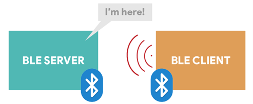
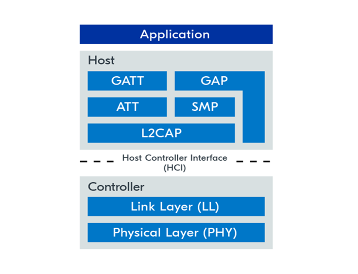
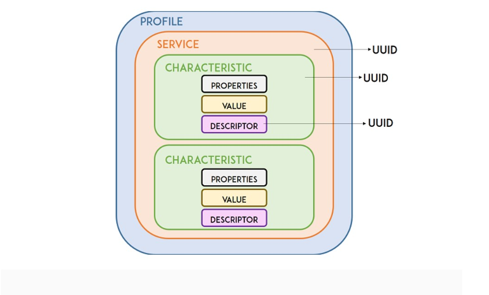
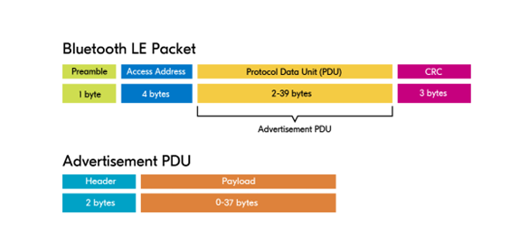
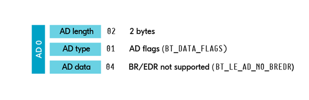

| Supported Targets | ESP32 | ESP32-C3 | ESP32-S3 | ESP32-S2 | ESP32-H6 |
| ----------------- | ----- | -------- | -------- | -------- | -------- |

# Bluetooth Low Energy (BLE) Overview

## 1. Introduction
Bluetooth Low Energy (BLE) is a low-energy Bluetooth protocol distinct from traditional Bluetooth, designed for data exchange between devices over short distances (typically up to 10 meters). BLE devices use scanning and advertising techniques for communication, which can be connection-oriented or connectionless.

Due to its properties, BLE is suitable for applications that need to exchange small amounts of data periodically running on a coin cell. For example, BLE is of great use in healthcare, fitness, tracking, beacons, security, and home automation industries.

  

  
     
  

## 2. BLE Modes
BLE devices operate in four basic roles, with each role having distinct functionalities:

1. **Central (Master)**
2. **Peripheral (Slave)**
3. **Broadcaster**
4. **Observer**

### 2.1 Central
- **Role:** Master
- **Function:** Scans for advertising devices and can initiate connections. Capable of connecting to multiple devices simultaneously. Remember only the master device has capability to scan for such advertising devices and initiate a connection request.
- **Example:** A smartphone connecting to a fitness tracker.

### 2.2 Peripheral
- **Role:** Slave
- **Function:** Advertises data and connects to a Central device upon request. Cannot initiate connections.
- **Example:** Wireless earphones connecting to a mobile phone.

### 2.3 Broadcaster
- **Function:** Continuously advertises data but cannot establish connections.
- **Components:**
  - **Advertising Data:** Information about the broadcaster such as its address and device name.
  - **Scan Response Packet:** Sent in response to a scan request, providing additional information.
- **Example:** Beacons and Apple AirTags.

### 2.4 Observer
- **Function:** Scans and receives advertising packets but cannot connect to advertising devices.
- **Example:** A device monitoring crowd density by scanning nearby smartphones.

## 3. Client/Server Model
In the BLE client-server model:
- **Peripheral:** Acts as the server, advertising its presence.
- **Central:** Acts as the client, scanning and initiating connections.

 
  
  

The Bluetooth is based on server/client communication. The server advertises his presence and the client scans the presence of the server. We need a pairing concept for transmitting or receiving data for security purposes. When two devices want to pair, they search for a common frequency to send or receive data. For connection, the client device needs server UUID's (service UUID, characteristics UUID, and device name). The server can be connected to only one device at a time.

## 4. BLE Architecture
The BLE architecture consists of three main levels:

4.1 **Controller (Hardware):**
   - Operates on the 2.4GHz ISM band.
   - Divided into 40 RF channels (3 for broadcasting: 37, 38, 39).

4.2 **Host:**
   - **GATT (Generic Attribute Profile):** Manages data through attributes accessible via the client-server model.
   - **GAP (General Access Profile):** Manages device discovery, connection establishment, and bonding processes.
  
   ### GATT

   GATT stands for Generic Attributes and defines a hierarchical data structure exposed to connected BLE devices. This means that GATT establishes how two BLE devices send and receive standard messages. Understanding this hierarchy is important because it will make it easier to understand how to use the BLE and write your applications.

  
     
  

### 4.2.1.1  BLE Service 
  -The top level of the hierarchy is a profile, which is composed of one or more services. Usually, a BLE device contains more than one service. Every service contains at least one characteristic, or can also reference other services. A service is simply a collection of information, like sensor readings, for example. There are predefined services for several types of data defined by the SIG (Bluetooth Special Interest Group) like Battery Level, Blood Pressure, Heart Rate, Weight Scale, etc.

### 4.2.1.2  BLE Characteristics

-The characteristic is always owned by a service, and it is where the actual data is contained in the hierarchy (value). The characteristic always has two attributes: characteristic declaration (that provides metadata about the data) and the characteristic value. Additionally, the characteristic value can be followed by descriptors, which further expand on the metadata contained in the characteristic declaration. The properties describe how the characteristic value can be interacted with. It contains the operations and procedures that can be used with the following characteristics:
  - Broadcast
  - Read
  - Write
  - Write without response
  - Notify
  - Indicate

### 4.2.1.3  UUID
Each service, characteristic, and descriptor has a UUID (Universally Unique Identifier). An UUID is a unique 128-bit (16 bytes) number. For example:

`61a902ab-832b-48d7-853e-a542534a3f10`

### GAP
GAP allows BLE devices to interoperate with each other. It provides a set of rules or procedures so that devices can discover each other, broadcast data, establish secure connections, perform functional operations and set device configurations.
     
### 4.4 **Security Manager Protocol (SMP)**
   - The Security Manager Protocol in BLE is a critical component that handles the security aspects of BLE communication, including pairing, bonding, and encryption.

### 4.5 **Application/Profiles:**
   - Interfaces directly with the GAP to handle device discovery and connection-related services.

## 5. Network Topology
### 5.1 Broadcast Topology
- **Function:** Data transfer without establishing connections.
- **Advantages:** Efficient for broadcasting to multiple devices simultaneously, low power consumption.
- **Disadvantages:** Limited throughput, no acknowledgment from receiving devices.
- **Example:** Proximity beacons in indoor navigation.

### 5.2 Connected Topology
- **Function:** Bi-directional communication with higher throughput.
- **Advantages:** Reliable data transfer with acknowledgment.
- **Disadvantages:** Higher power consumption, limited number of connections.
- **Example:** Smart home devices communicating with a central hub.

### 5.3 Multi-Role Topology
- **Function:** Devices act as both Central and Peripheral.
- **Example:** A smart home hub receiving sensor data from peripherals and forwarding it to a smartphone.

## 6. Advertising Types
BLE devices can use various advertising types, each serving a specific purpose:

1. **Scannable and Connectable (ADV_IND):** Allows discovery and connections. Commonly used by peripherals.
2. **Directed Connectable (ADV_DIRECT_IND):** Used for directed advertisement without scan requests.
3. **Non-Connectable and Scannable (ADV_SCAN_IND):** Accepts scan requests but no connections.
4. **Non-Connectable and Non-Scannable (ADV_NONCONN_IND):** Does not accept scan requests or connections, reducing battery consumption.

## 7. Bluetooth Address
Every BLE device has a unique 48-bit address, categorized into public and random addresses:

1. **Public Address:**
   - Fixed, globally unique, programmed at the manufacturer.

2. **Random Address:**
   - **Static:** Fixed throughout the device's lifetime.
   - **Private:** Changes periodically for privacy, further classified into resolvable and non-resolvable.

## 8. Advertising Packet Structure
The BLE advertising packet consists of a header and a payload:

     
  

     

1. **Header:**
   - **PDU Type:** Type of advertisement.
   - **Length:** Length of the payload.
   - **TxAdd/RxAdd:** Indicates if the addresses are public or random.

2. **Payload:**
   - **AdvA:** Advertiser's address.
   - **AdvData:** Advertisement data (e.g., device name, service UUID).

### 8.1 Advertising Data Structure
Composed of multiple structures called advertisement data structures (AD structures):

- **Complete Local Name:** The device name seen by users.
- **Service UUID:** Identifies specific services.
- **Manufacturer Specific Data:** Custom advertising data defined by manufacturers.
- **Flags:** 1-bit variables indicating properties or operational modes.

  

     
  

     

     
  

     

