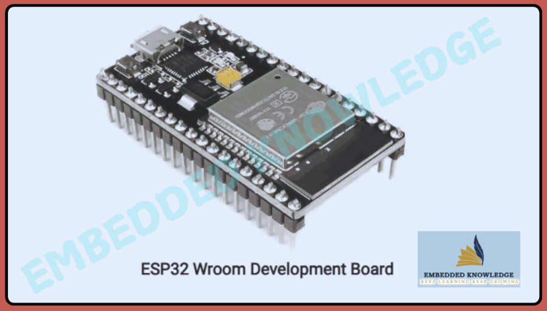
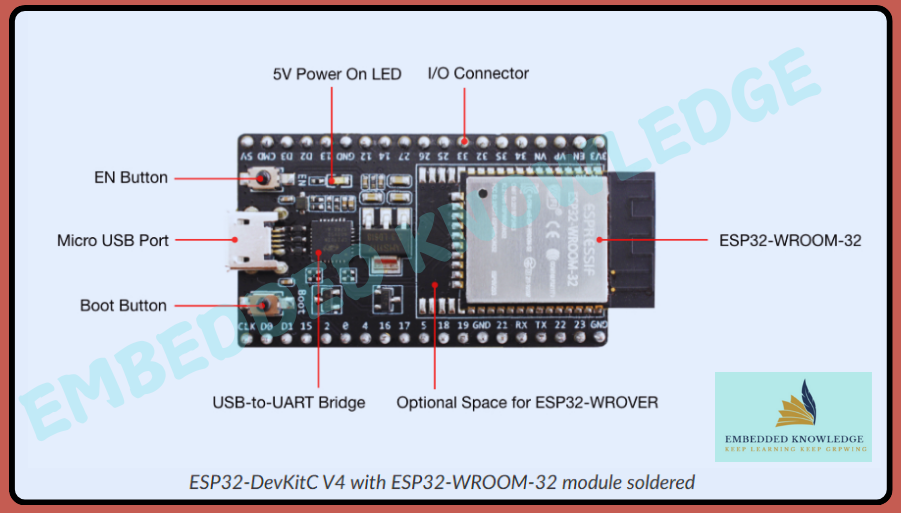
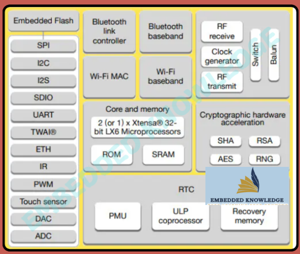
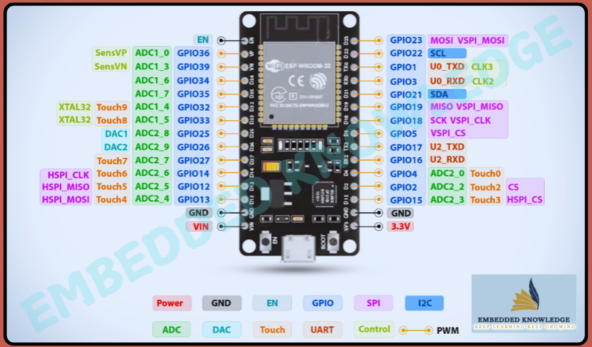
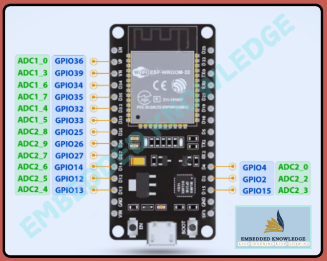
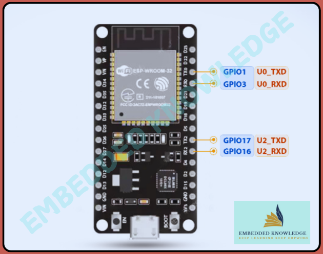

# ESP_IDF_PROJECT

---
| Supported Targets | ESP32 | ESP32-C3 | ESP32-S3 | ESP32-S2 | ESP32-H6 |
| ----------------- | ----- | -------- | -------- | -------- | -------- |


# ESP32 Programming Course: Chapter Zero

Welcome to the **ESP32 Programming Course** repository! This repository serves as a guide, where we explore the theoretical foundations of the ESP32 module. If you're looking to get started with ESP32 development, this is the perfect place to begin.

---

## 📘 Overview


   ## ESP32 Development Board

     


*An overview of ESP32's Development Board.*

     

In Chapter Zero, we cover the following topics:
- ESP32 Pinout, Datasheet, and Specifications.
- Key Features and Applications.
- ESP32 Modules and Development Boards.
- Communication Protocols.

This chapter provides the essential knowledge required to prepare for practical ESP32 programming in upcoming chapters.

---

## 🛠 Key Features of ESP32

     
*An overview of ESP32's core features.*

- **Dual-core Tensilica Xtensa LX6 processor** with a clock speed of up to 240 MHz.
- **Built-in WiFi and Bluetooth v4.2** for IoT applications.
- 12-bit ADC (18 channels) and 8-bit DAC (2 channels).
- Low-power modes for battery-operated devices.

For a complete list of features, please take a look at the [full documentation](https://docs.espressif.com/projects/esp-idf/en/stable/esp32/get-started/index.html).

---

## 📊 Technical Specifications

| Feature                        | Details                          |
|--------------------------------|----------------------------------|
| Processor                      | Tensilica Xtensa LX6 (Dual/Single) |
| RAM                            | 520 KB                           |
| Storage                        | 448 KB Flash                     |
| Communication Protocols        | Wi-Fi, Bluetooth, UART, SPI, I2C |
| Operating Voltage              | 3.3V                             |

[ESP32 Technical Reference Mannual](https://r.search.yahoo.com/_ylt=AwrKCZyrfIln7QEAh.a7HAx.;_ylu=Y29sbwNzZzMEcG9zAzEEdnRpZAMEc2VjA3Ny/RV=2/RE=1738273195/RO=10/RU=https%3a%2f%2fwww.espressif.com%2fsites%2fdefault%2ffiles%2fdocumentation%2fesp32_technical_reference_manual_en.pdf/RK=2/RS=Uwo7lt.l_mOlAT1oxivsKeX_yfM-)


---

## 📍 ESP32 Pinouts

ESP32 Development board features GPIO, ADC, DAC, and specialized pins for capacitive touch and low-power RTC modes.

### ESP32-WROOM-32 Pinout
  
*The pinout diagram for the ESP32-WROOM-32.*

**GPIO:** Total 32 Multifunctional GPIOs are available on the ESP-Wroom-32 development board which can be used for input/output devices. Every GPIO pin can be configured as an internal pull-up, pull-down, or set to high impedance. The input can also be set to edge-trigger or level-trigger to generate CPU interrupts.

**Note:** GPIO34, GPIO35, GPIO36, and GPIO39 are the only input pins

### ESP32-ADC Pinout
  
*The ADC pinout diagram for the ESP32-WROOM-32.*

**ADC:** On-chip 12-bit SAR (Successive Approximation Registers) ADCs (Analog to Digital Converter) which supports measurements on 16 channels of ESP32.

### ESP32-DAC Pinout
  
*The DAC pinout diagram for the ESP32-WROOM-32.*

**DAC:** On-chip two 8-bit DAC (Digital to Analog) channels to produce digital signals into analog voltage signal outputs. Both DAC channels can also support independent conversions.

### ESP32-RTC GPIO Pinout
  
*The RTC GPIO pinout diagram for the ESP32-WROOM-32.*

### ESP32-PWM GPIO Pinout
  
*The PWM pinout diagram for the ESP32-WROOM-32.*

**PWM:** ESP32 development board has support 8-bit 32 channels PWM. The pins with the symbol ‘~’ represent that it has PWM support. It can be used for dimming LEDs or controlling motors etc.

### ESP32-Capacitive Touch Sensor
  
*The Capacitive Touch Sensor pinout diagram for the ESP32-WROOM-32.*

**TOUCH Pad:** ESP32 has 10 capacitive sensing GPIOs, that detect physical touch by the human body. This technique can replace mechanical buttons and switches to eliminate mechanical wear and tear

## 📡 Communication Protocols

ESP32 supports the following communication protocols:
- **Wi-Fi** (802.11 b/g/n)
- **Bluetooth v4.2** (BR/EDR and BLE)
- **UART**, **SPI**, **I2C**, **I2S**, and **CAN**
- 
### ESP32- Uart GPIO
  
*The Uart gpio pinout diagram for the ESP32-WROOM-32.*

**UART:** ESP32 development board has two UART interfaces UART0 and UART1. Both provide asynchronous communication and support to RS232, RS485, and IrDA too.

**I2C:** The ESP32 development board has only one I2C bus interface (Supported in Arduino IDE). which can serve as an I2C master or slave, depending on the user’s configuration.

**The I2C interfaces support:**

- Standard mode Support (100 Kbit/s)
- Fast mode Support (400 Kbit/s)
- Support both 7-bit and 10-bit addressing modes
- Dual addressing mode

**SPI:** ESP32 has three SPIs which are SPI, HSPI, and VSPI. These SPIs also support the following general-purpose SPI features:

- Four modes of SPI transfer format (depend on the polarity and the phase of the SPI clock)
- Speed Up to 80 MHz 
- up to 64-byte FIFO

These features make it ideal for IoT and connected device applications.

---

## 🌟 Applications

*Examples of ESP32 applications in IoT, home automation, and wearable devices.*

- IoT devices and cloud-based systems.
- Wearable electronics.
- Home automation and smart security.
- Low-power, battery-operated devices.

---

## 📂 Resources and Links

- [ESP32 Datasheet](https://r.search.yahoo.com/_ylt=AwrKCZyuc4lnEQIASXW7HAx.;_ylu=Y29sbwNzZzMEcG9zAzEEdnRpZAMEc2VjA3Ny/RV=2/RE=1738270895/RO=10/RU=https%3a%2f%2fwww.espressif.com%2fsites%2fdefault%2ffiles%2fdocumentation%2fesp32_datasheet_en.pdf/RK=2/RS=U3u.n_8fGFEXdQLKhAj5k4HXje0-)
- [Official ESP-IDF Documentation](https://docs.espressif.com/projects/esp-idf/en/latest/)

---

## 🚀 Next Steps

In the next chapter, we'll set up the development environment for ESP32 programming and start with hands-on projects. Stay tuned!

---

## **Way of Programming for ESP32**

The ESP32 supports both C/C++ and MicroPython programming languages that you can use to program your ESP32. Now, let’s check the supported ide for both types of languages.

### Here’s a list of IDEs that supports to program the ESP32 series boards with C/C++.

- VS Code + ESP-IDF.
- Arduino IDE
- VS Code + PlatformIO IDE

### Here’s a list of IDEs that supports to program the ESP32 series boards with MicroPython.

- Thonny IDE
- PyCharm
- Mu Editor
- uPyCraft IDE
- VS Code + Pymakr extension


This repository contains an ESP-IDF (Espressif IoT Development Framework) project developed by Kuldeep Kumar Chandel.

 **Cloning the Repository:**
   ```bash
   git clone https://github.com/Kuldeepkumarchandel/ESP_IDF_PROJECT.git
